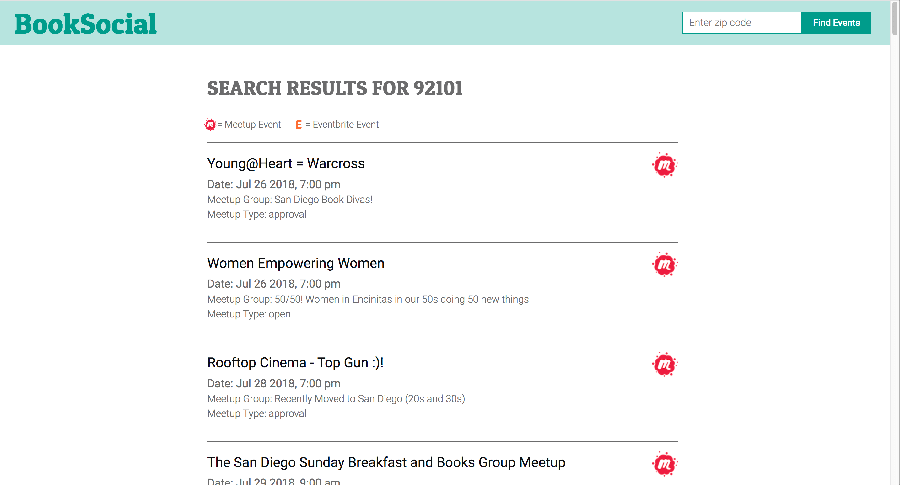

# BookSocial #

This app allows the user to search for literary events in their area by entering a zip code. Results are pulled from Meetup and Eventbrite.

## Screenshots ##

**Login Screen**

**Search Results Page**

## Technical ##

BookSocial was built with:

* HTML5
* CSS3
* JavaScript
* jQuery

## Development Road Map
Features for future iterations include:
* Sort by date to integrate results
* Add more event APIs to provide more results

## To Run App Locally ##

- Git clone https://github.com/jes-a/BookSocial.git
- Run npm install to install node-module packages
- Run http-server on Terminal and app opens on localhost:8080

* * *

**Live version:** [BookSocial](https://jes-a.github.io/BookSocial-api-capstone/)
